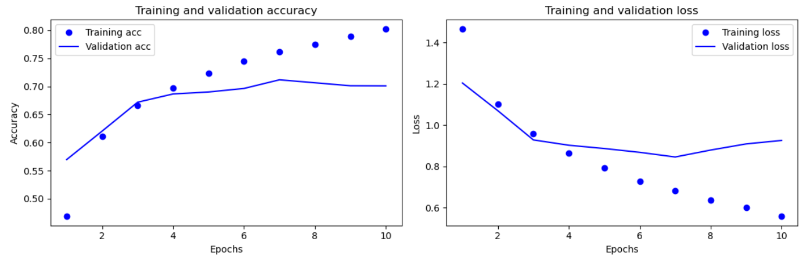
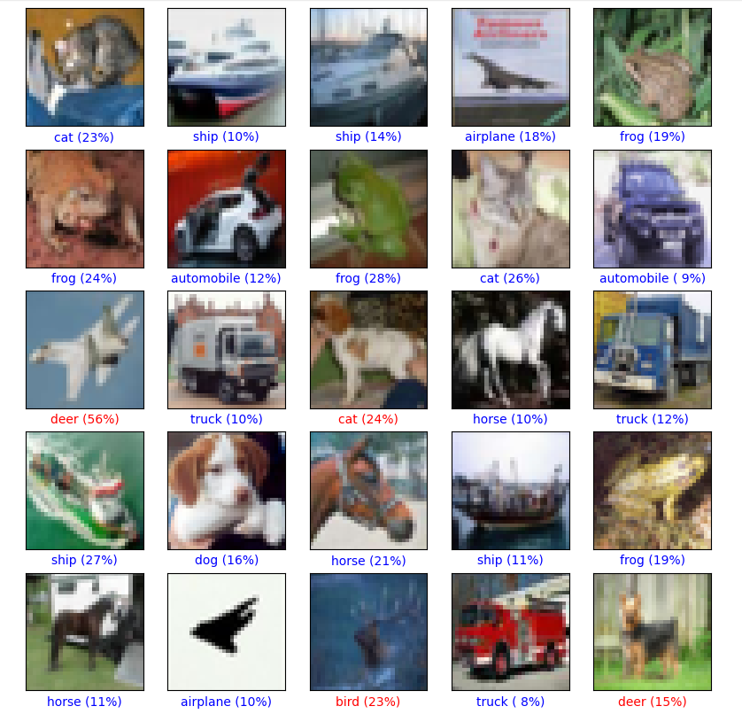

# Image-Classification-on-CIFAR-10-Dataset

## Overview
This project demonstrates image classification using the CIFAR-10 dataset with a deep learning model built in TensorFlow/Keras. The CIFAR-10 dataset consists of 60,000 32x32 color images in 10 classes, divided into 50,000 training images and 10,000 test images. The classes include airplanes, automobiles, birds, cats, deer, dogs, frogs, horses, ships, and trucks.

---

## Features
- **Dataset**: CIFAR-10 (60,000 images across 10 classes).
- **Preprocessing**: Normalization and one-hot encoding of labels.
- **Deep Learning Model**:
  - Convolutional layers for feature extraction.
  - MaxPooling layers for dimensionality reduction.
  - Fully connected layers for classification.
- **Training**: Model trained for multiple epochs with validation.
- **Evaluation**: Accuracy and loss metrics on the test set.
- **Visualization**: Training history plots for loss and accuracy.

---

## Requirements
Install the following Python libraries:
```bash
pip install tensorflow numpy matplotlib
```

---

## Steps to Run

### Step 1: Import Libraries
The required libraries include:
```python
import tensorflow as tf
import numpy as np
import matplotlib.pyplot as plt
from tensorflow.keras import layers, models
from tensorflow.keras.datasets import cifar10
from tensorflow.keras.utils import to_categorical
```

### Step 2: Load and Preprocess the Dataset
Load the CIFAR-10 dataset and preprocess it:
```python
(train_images, train_labels), (test_images, test_labels) = cifar10.load_data()
train_images, test_images = train_images / 255.0, test_images / 255.0  # Normalize pixel values
train_labels = to_categorical(train_labels)
test_labels = to_categorical(test_labels)
```

### Step 3: Build the Model
Define a sequential model with convolutional layers:
```python
model = models.Sequential([
    layers.Conv2D(32, (3, 3), activation='relu', input_shape=(32, 32, 3)),
    layers.MaxPooling2D((2, 2)),
    layers.Conv2D(64, (3, 3), activation='relu'),
    layers.MaxPooling2D((2, 2)),
    layers.Conv2D(64, (3, 3), activation='relu'),
    layers.Flatten(),
    layers.Dense(64, activation='relu'),
    layers.Dense(10)  # Output layer for classification into 10 classes
])
```

### Step 4: Compile the Model
Compile the model with an optimizer and loss function:
```python
model.compile(optimizer='adam',
              loss=tf.keras.losses.CategoricalCrossentropy(from_logits=True),
              metrics=['accuracy'])
```

### Step 5: Train the Model
Train the model on the training data:
```python
history = model.fit(train_images, train_labels,
                    epochs=10,
                    validation_data=(test_images, test_labels))
```

### Step 6: Evaluate the Model
Evaluate the model on the test set:
```python
test_loss, test_acc = model.evaluate(test_images, test_labels)
print(f"Test accuracy: {test_acc}")
```

### Step 7: Visualize Training History
Plot training history for loss and accuracy:
```python
plt.plot(history.history['accuracy'], label='Training Accuracy')
plt.plot(history.history['val_accuracy'], label='Validation Accuracy')
plt.xlabel('Epochs')
plt.ylabel('Accuracy')
plt.legend()
plt.show()
```


---

## Results
The model achieves approximately **70% accuracy** on the CIFAR-10 test set after training for ten epochs.

---


---

## Notes
- Ensure TensorFlow is installed before running this code.
- You can adjust hyperparameters such as the number of epochs or optimizer settings to improve performance.
- The dataset is loaded directly from Keras's in-built library (`cifar10`).

---

## Future Enhancements
1. Experiment with deeper architectures like ResNet or VGGNet for better accuracy.
2. Use data augmentation techniques to improve generalization.
3. Implement transfer learning with pre-trained models.

---

## Contributions

Contributions are welcome! Feel free to open issues or submit pull requests.

---

## Contact

For any queries, reach out to suyashbargal@gmail.com
